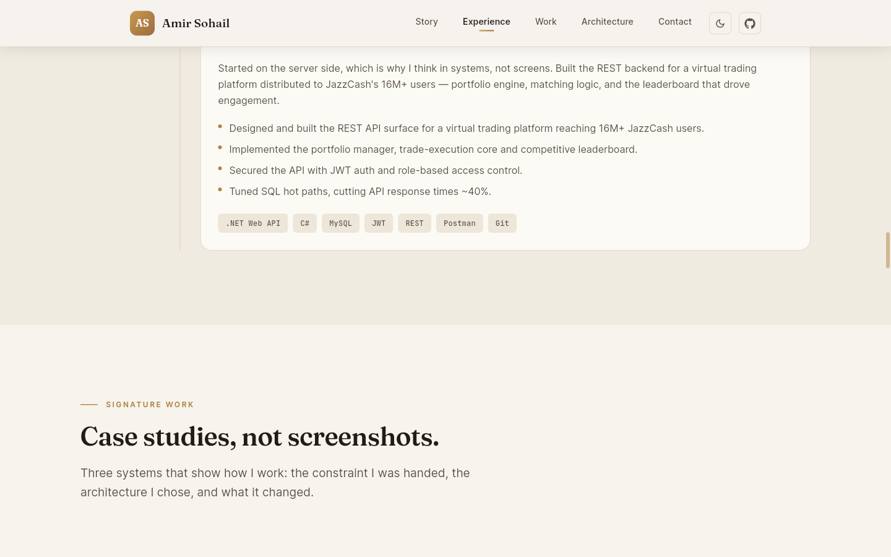
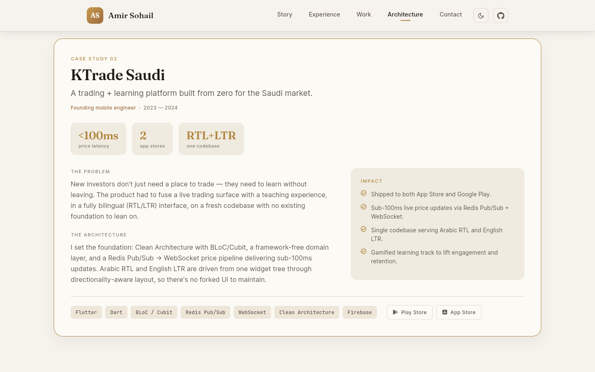
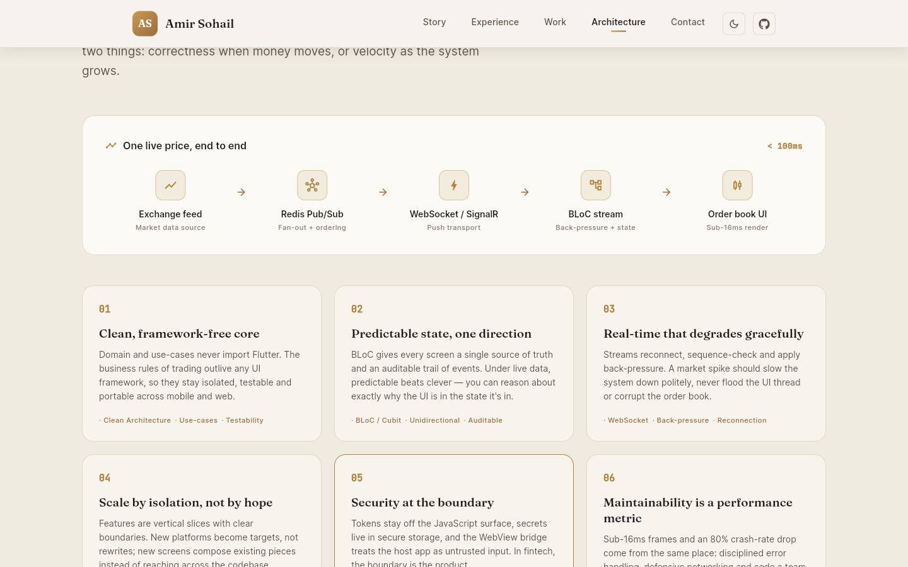
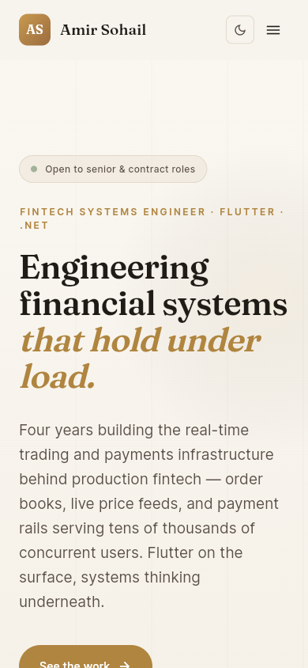
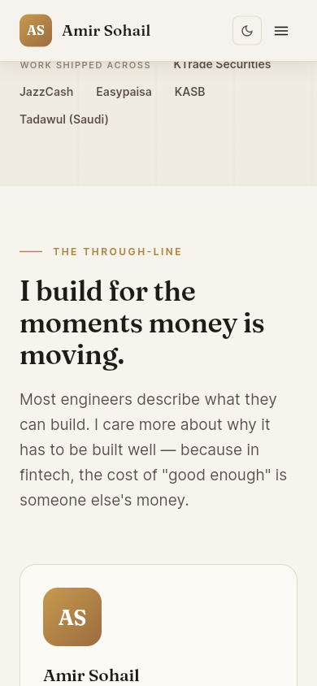
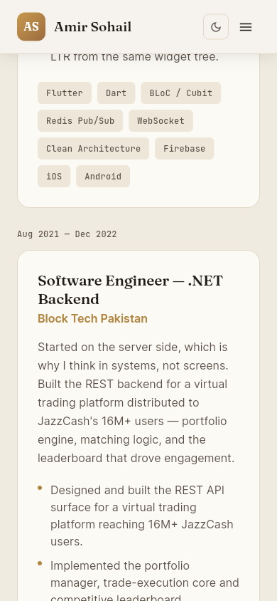

<!-- Banner adapts to GitHub's light/dark theme -->
<picture>
  <source media="(prefers-color-scheme: dark)" srcset="docs/screenshots/hero-dark.png">
  
</picture>

<h1 align="center">Amir Sohail — FinTech Systems Engineer Portfolio</h1>

<p align="center">
  <em>Engineering financial systems that hold under load.</em><br>
  A personal portfolio built in Flutter Web — warm, editorial, and meant to read like
  the work itself.
</p>

<p align="center">
  
  
  
  
  
</p>

---

## About

This is the portfolio of **Amir Sohail**, a FinTech systems engineer specialising in
**real-time trading and payments infrastructure**. The site is deliberately positioned
around the *systems* — order books, live price feeds, payment rails — rather than the
framework. Flutter is on the surface; systems thinking is underneath.

The numbers it leads with come straight from production work: **50K+ active traders**,
**~5K concurrent live sessions**, **22M+ payment-app users reached**, and a
**~80% crash-rate reduction** on KTrade 2.0.

> **Status:** the visual identity and structure are in place. Content is being expanded
> next with real product media (JazzCash, Easypaisa, KTrade Saudi) and richer case
> studies — see [Roadmap](#roadmap).

---

## Screenshots

### Desktop

<table>
  <tr>
    <td width="50%"></td>
    <td width="50%"></td>
  </tr>
  <tr>
    <td align="center"><sub>Case study: problem → architecture → impact</sub></td>
    <td align="center"><sub>“How I think about software” + live data-flow</sub></td>
  </tr>
</table>

### Mobile

<table>
  <tr>
    <td width="33%"></td>
    <td width="33%"></td>
    <td width="33%"></td>
  </tr>
  <tr>
    <td align="center"><sub>Hero</sub></td>
    <td align="center"><sub>Career story</sub></td>
    <td align="center"><sub>Experience timeline</sub></td>
  </tr>
</table>

> The hero banner at the top of this page switches between light and dark to match your
> GitHub theme.

---

## Highlights

- **A live trading-session card** in the hero — an animated ticker with moving prices and
  feed latency, standing in for "money in motion" instead of a generic graphic.
- **Animated metrics** that count up as they scroll into view.
- **Scroll-reveal motion** throughout, with staggered timing — and it backs off when the
  OS "reduce motion" setting is on.
- **Case studies, not cards** — each signature project is told as problem → challenge →
  architecture → impact (KTrade 2.0, KTrade Saudi, JazzCash/Easypaisa).
- **An architecture section** — "How I think about software" with a real-time data-flow
  trace (exchange feed → Redis Pub/Sub → WebSocket/SignalR → BLoC → sub-16ms render).
- **Light + dark themes** — warm ivory by default, deep espresso on toggle.
- **Responsive** from wide desktop down to mobile, with a stacked layout and drawer nav.

---

## Design system

A warm, editorial, "high-end consulting" palette — intentionally no blue, purple, or neon.

<p>
  
  
  
  
  
  
</p>

**Type:** [Fraunces](https://fonts.google.com/specimen/Fraunces) (warm optical serif) for
display and headlines · [Inter](https://fonts.google.com/specimen/Inter) for body and UI ·
[JetBrains Mono](https://fonts.google.com/specimen/JetBrains+Mono) for metrics and data.

---

## Architecture & tech stack

Built on **Clean Architecture** with a **feature-first** layout. The domain layer never
imports Flutter, so business logic stays testable and portable across mobile and web.

| Area | Choices |
| --- | --- |
| Framework | Flutter (Web + Mobile), Dart |
| State | `flutter_bloc` / `bloc`, `equatable` |
| Routing | `go_router` |
| Type & icons | `google_fonts`, `font_awesome_flutter`, `flutter_svg` |
| Motion & UX | `visibility_detector`, custom reveal/metric widgets, `shimmer` |
| Platform | `url_launcher` |

---

## Project structure

```
lib/
├── app.dart                      # MaterialApp + theme wiring
├── main.dart
├── core/
│   ├── constants/                # AppConstants — copy, metrics, section IDs
│   ├── theme/                    # AppColors, AppTextStyles, AppTheme
│   ├── widgets/                  # RevealOnScroll, AnimatedMetric, PremiumButton, …
│   ├── utils/                    # ResponsiveUtil, UrlLauncherUtil
│   └── bloc/                     # ThemeBloc (light/dark)
└── features/
    └── portfolio/
        ├── data/                 # repository impl (content)
        ├── domain/               # entities, repository, use-cases
        └── presentation/
            ├── pages/            # PortfolioPage (section composition)
            ├── bloc/             # PortfolioBloc
            ├── content/          # static narrative (story, architecture)
            └── widgets/sections/ # hero, story, experience, work, architecture, …
```

The page reads top to bottom as a career narrative:
**Hero → Story → Experience → Work (case studies) → Architecture → Skills → Vision → Contact.**

---

## Run it locally

```bash
flutter pub get

# Develop in the browser
flutter run -d chrome

# Production web build (outputs to build/web)
flutter build web --release
```

Requires the Flutter SDK (developed on Flutter 3.38 / Dart 3.x).

---

## Roadmap

- Expand the case studies with **real product media** — screenshots and demo videos for
  **JazzCash**, **Easypaisa**, and **KTrade Saudi** — using image/video carousels.
- Rewrite project copy against the **business-requirements docs** for accuracy and depth.
- Optional: a **live demo** via GitHub Pages.

---

## Contact

- **LinkedIn** — [linkedin.com/in/amirsohail110](https://linkedin.com/in/amirsohail110)
- **GitHub** — [github.com/amirsohail110](https://github.com/amirsohail110)
- **Email** — amir.sohail.pro@gmail.com

<sub>Designed & engineered in Flutter.</sub>
